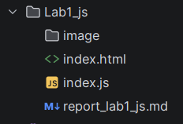
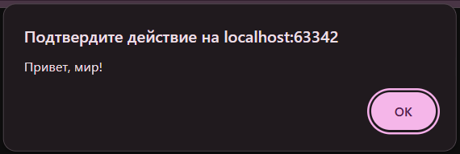
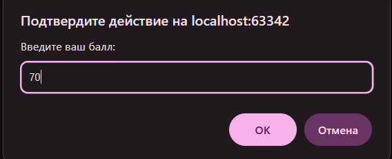

# Лабораторная работа №1
## Тема: Введение в JavaScript
**Дисциплина:** JavaScript  
**Студент:** Петровская Арина  
**Группа:** IA2504  
**Преподаватель:** Nartea. N  
**Год:** 2026

---

### Описание лабораторной работы

#### Цель
Изучить основы языка JavaScript, научиться выполнять код в браузере, подключать внешние скрипты, работать с переменными, 
типами данных, условиями и циклами, а также освоить использование инструментов разработчика.
#### Задачи
* Освоить запуск и выполнение JavaScript-кода в браузере с помощью консоли разработчика.
* Научиться создавать HTML-страницу и встраивать в неё JavaScript-код.
* Изучить способы подключения внешних JavaScript-файлов к HTML-документу.
* Научиться объявлять переменные различных типов данных и выводить их значения в консоль.
* Освоить использование условных операторов и циклов для управления выполнением программы.

---

### Выполнение лабораторной работы
#### Архитектура директории
Создаю директорию `Lab1_js.js`, где будут храниться все нужные папки и файлы (рис. 1)  
###### рис. 1
**Лабораторная работа имеет следующую структуру:**  
    - папка `image` (хранение скриншотов экрана);  
    - файл `index.html` (для подключения js-файла к html-странице);  
    - файл `script.js` (работа с JavaScript);  
### Задание 1. Выполнение кода в браузере
1. ##### Скачиваем Node.js с [официального сайта](https://nodejs.org/en)
2. ##### Открываем консоль и пишем приветственное сообщение. Запускаем его.
   ```
   > console.log('Hello, world!')
   Hello, world!
   ```
   Пишем математическую операцию
   ```
   > 1 + 2
   3
   ```
   Node.js выполняет данное выражение, потому что это валидное JavaScript-выражение, 
   которое вычисляется и результат сразу выводится.
3. ##### Создаем файл `index.html` и пишем код
   ```html
   <!DOCTYPE html>
   <html lang="ru">
   <head>
      <meta charset="UTF-8">
      <title>Привет, мир!</title>
   </head>
   <body>
   <script>
       alert("Привет, мир!");
       console.log("Hello, console!");
   </script>
   </body>
   </html>
   
   ```
   Открываем `index.html` в браузере и посмотрим, как выполняется код [рис. 2]
   ###### рис. 2  
4. ##### Подключаем внешний JavaScript-файл
   Создаем файл script.js и пишем код:
   ```javascript
   alert("Этот код выполнен из внешнего файла!");
   console.log("Hello!");
   
   ```
   В файл `index.html` в `head` подключаем внешний файл  
   `<script src="script.js"></script>`
### Задание 2. Работа с типами данных
1. В файле `script.js` создаем три переменные с разными типами данных и выводим результат на экран
   ```javascript
   let name = 'Arina';
   let birthYear = 2004;
   let isStudent = true;

   console.log(name);
   console.log(birthYear);
   console.log(isStudent);
   
   ```  
   Вывод в консоли
   ```
   Arina
   2004
   true
   ```  
2. ##### Управление потоком выполнения (условия и циклы)
   Добавляем код в `script.js`
   ```javascript
   let score = prompt("Введите ваш балл:");
   if (score >= 90) {
   console.log("Отлично!");
   } else if (score >= 70) {
   console.log("Хорошо");
   } else {
   console.log("Можно лучше!");
   }
   
   for (let i = 1; i <= 5; i++) {
   console.log(`Итерация: ${i}`);
   }
   
   ```  
   В данном случае скрипт проверяет балл и выводит результат [рис. 3]  
   рис. 3
##### Контрольные вопросы
**Чем отличается var от let и const?**   
`var` является устаревшим способом и имеет ряд особенностей
* Область видимости — функция, а не блок { }
* Можно объявлять повторно
* Поднимается вверх (hoisting)  

`let` - более современный способ
* Область видимости — блок { }
* Нельзя объявлять дважды в одной области
* Значение можно менять
**Что такое неявное преобразование типов в JavaScript?**   
Это когда JavaScript сам автоматически меняет тип данных, без определенной команды, чтобы выполнить операцию или сравнение.  
   ```javascript
   "5" + 2      // "52"  (число → строка)
   "5" - 2      // 3     (строка → число)
   true + 1     // 2
   false == 0   // true
  
   ``` 
**Как работает оператор == в сравнении с ===?**   
`==` — обычное сравнение (с преобразованием типов)
   ```javascript
   5 == "5" // true
   0 == false // true
   null == undefined // true

   ``` 
`===` — строгое сравнение (без преобразования)
   ```javascript
   5 == "5"      // true
   0 == false   // true
   null == undefined // true

   ``` 
### [Официальная документация JavaScript](https://developer.mozilla.org/en-US/docs/Web/JavaScript)